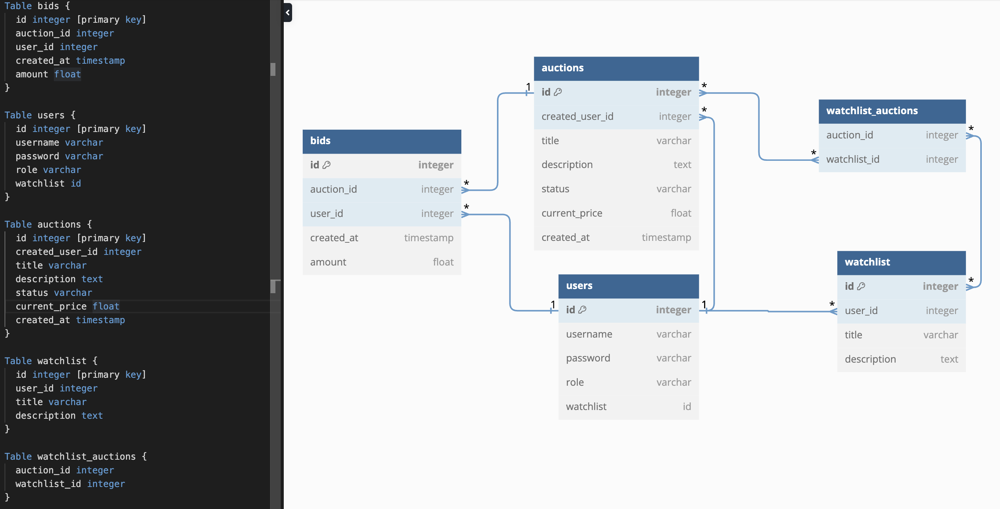

# AuctionApplication

## Problem to solve

## How tasks are allocated

## Third-party services, packages and dependencies

## Benefits and drawbacks of database system
PostgreSQL is a powerful, open-source relational database management system (RDBMS) that offers numerous benefits. Its open-source nature makes it cost-effective, supported by a large and active community that contributes to its ongoing development. The database boasts advanced features like JSONB for handling unstructured data, full-text search, and GIS capabilities through PostGIS, making it highly versatile. Its extensibility allows users to create custom data types, operators, and functions. Additionally, PostgreSQL is ACID compliant, ensuring reliable transactions and data integrity, and it utilizes Multi-Version Concurrency Control (MVCC) for high concurrency without table locking.

However, PostgreSQL also has some drawbacks. Its extensive feature set can create a steeper learning curve for newcomers, particularly those unfamiliar with SQL or relational databases. Performance tuning may be necessary for optimal results, especially under heavy loads. While it generally performs well, PostgreSQL can lag behind some NoSQL databases in write-heavy scenarios. It lacks native sharding capabilities, which can complicate horizontal scaling, and can be resource-intensive compared to lightweight alternatives. Finally, upgrading between major versions may introduce compatibility issues that require careful management. Overall, PostgreSQL is an excellent choice for many applications, but its complexity and performance considerations may not make it suitable for every situation.
## ORM features
SQLAlchemy is a widely-used Object-Relational Mapping (ORM) system for Python that simplifies interactions with relational databases. It allows developers to map Python classes to database tables, making it easier to handle database records as Python objects. With features such as flexible querying, session management, and automatic schema generation, SQLAlchemy streamlines the process of setting up and managing databases. It also supports multiple database types, providing portability across different systems, and offers mechanisms for eager and lazy loading of related objects to optimize performance.

The primary purpose of SQLAlchemy is to abstract the complexities of SQL, allowing developers to interact with databases using familiar Python constructs. This approach speeds up development and enhances code maintainability, enabling developers to focus more on application logic rather than database intricacies.

SQLAlchemy provides a range of functionalities, including defining models as Python classes, managing database sessions, and executing complex queries through its SQL expression language. It simplifies relationship management between tables and ensures transaction management for data integrity. Additionally, SQLAlchemy integrates with tools like Alembic for handling database migrations, making it easy to evolve database schemas over time. Overall, SQLAlchemy is a powerful tool that enhances developer productivity while maintaining the flexibility of relational databases.
## Entity relationship diagram

## Models and relationships

## API endpoints