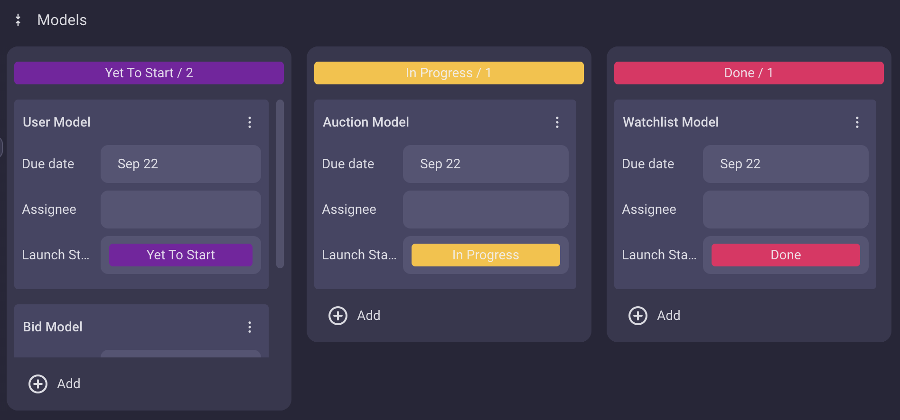
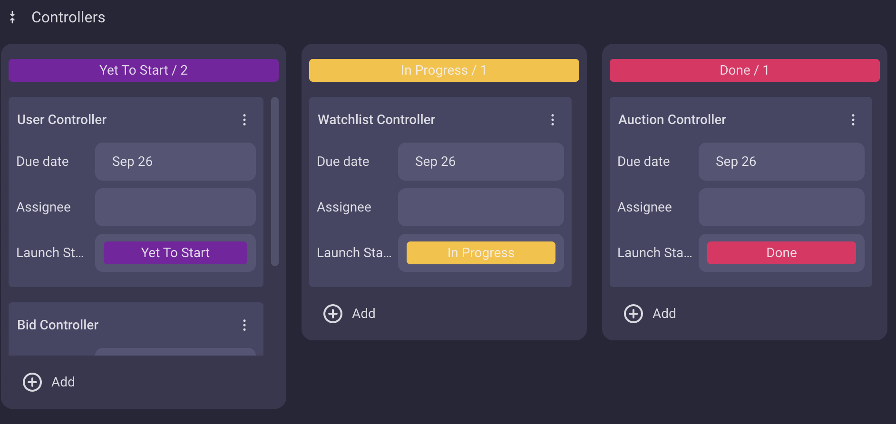
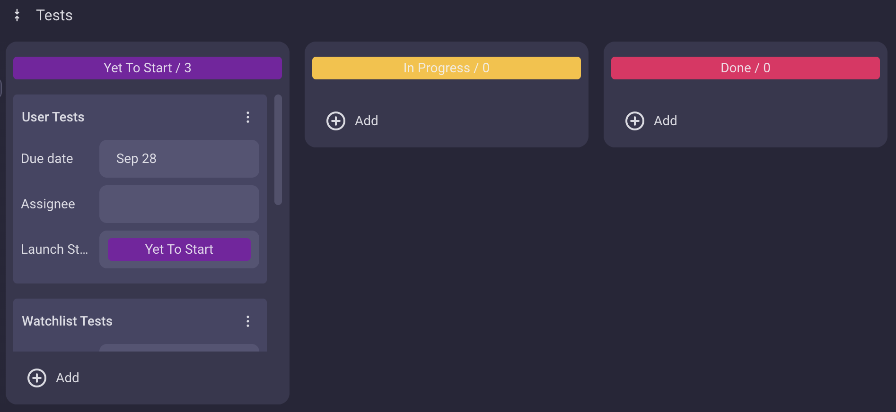

# AuctionApplication

## Problem to solve
The purpose of the project is to create a simple auction application that allows users to create, edit, and delete auctions, bid on auctions, and add auctions to watchlists. The application should also allow users to view their watchlists and bids. The application utilises best practices for database design and security, including using a relational database management system (RDBMS) and implementing secure authentication and authorisation mechanisms. Additionally, the application is well-documented and adheres to best practices for code structure and naming conventions. The project is designed to be scalable and maintainable, with clear separation of concerns and a modular architecture. Finally, the application is thoroughly tested to ensure its functionality and security.
## How tasks are allocated
Tasks were planned and allocated using the Kanban board below. The board is divided into three columns: To Do, In Progress, and Done. Each column represents a stage in the development process, with the To Do column representing tasks that need to be completed, the In Progress column representing tasks that are currently being worked on, and the Done column representing tasks that have been completed. Tasks were created and assigned to each column based on their importance and urgency, with the highest priority tasks being placed in the To Do column.

## Third-party services, packages and dependencies
- Flask
  - `flask`
  - `flask.Blueprint`
  - `flask.request`

  Flask was used to create the application's routes and handle HTTP requests. It provided a simple and flexible way to define routes and handle different HTTP methods. The `Blueprint` class was used to create separate routes for different functionalities, making it easier to organize and manage the application's routes. The `request` object was used to access information about the incoming request, such as the URL, headers, and query parameters.
- SQLAlchemy
  - `sqlalchemy`
  - `sqlalchemy.exc.IntegrityError`
  - `db`

  SQLAlchemy was used to interact with the database. It provided a ORM that was powerful and flexible way to query and manipulate data in the database. The `db` object is initialised in `init.py`, which is then used throughout the application to interact with the database.
- Psycopg2
  - `psycopg2`
  - `psycopg2.errorcodes`

  Psycopg2 was used to interact with the PostgreSQL database. It provided a Python interface to the database, allowing developers to execute SQL queries and manipulate data. The `errorcodes` module was used to handle specific error codes returned by the database.
- Flask-JWT-Extended
  - `flask_jwt_extended`
  - `flask_jwt_extended.create_access_token`
  - `flask_jwt_extended.get_jwt_identity`
  - `JWTManager`

  Flask-JWT-Extended was used to implement secure authentication and authorisation in the application. It provided a simple and flexible way to create and verify JSON Web Tokens (JWTs), which are used to authenticate and authorise users. The `create_access_token` function was used to create JWTs, and the `get_jwt_identity` function was used to retrieve the user's identity from the JWT.
- Datetime
  - `datetime`
  - `datetime.timedelta`

  The `datetime` module was used to handle date and time operations in the application. The `timedelta` class was used to calculate the difference between two dates.
- Bcrypt
  - `bcrypt`

  The `bcrypt` module is initialised in `init.py` and was used to hash passwords securely. It provides a simple and efficient way to store and verify passwords, making it a popular choice for secure authentication.
- Marshmallow (used for serialization/deserialization)
  - `marshmallow`
  - `ma`

  Marshmallow was used to serialize and deserialize data in the application. Initialised in init.py as `ma`, it provides a powerful and flexible way to convert Python objects to and from JSON. This was used to convert SQLAlchemy models to JSON objects for serialization and deserialization.
## Benefits and drawbacks of database system
PostgreSQL is a powerful, open-source relational database management system (RDBMS) that offers numerous benefits. Its open-source nature makes it cost-effective, supported by a large and active community that contributes to its ongoing development. The database boasts advanced features like JSONB for handling unstructured data, full-text search, and GIS capabilities through PostGIS, making it highly versatile. Its extensibility allows users to create custom data types, operators, and functions. Additionally, PostgreSQL is ACID compliant, ensuring reliable transactions and data integrity, and it utilizes Multi-Version Concurrency Control (MVCC) for high concurrency without table locking.

However, PostgreSQL also has some drawbacks. Its extensive feature set can create a steeper learning curve for newcomers, particularly those unfamiliar with SQL or relational databases. Performance tuning may be necessary for optimal results, especially under heavy loads. While it generally performs well, PostgreSQL can lag behind some NoSQL databases in write-heavy scenarios. It lacks native sharding capabilities, which can complicate horizontal scaling, and can be resource-intensive compared to lightweight alternatives. Finally, upgrading between major versions may introduce compatibility issues that require careful management. Overall, PostgreSQL is an excellent choice for many applications, but its complexity and performance considerations may not make it suitable for every situation.
## ORM features
SQLAlchemy is a widely-used Object-Relational Mapping (ORM) system for Python that simplifies interactions with relational databases. It allows developers to map Python classes to database tables, making it easier to handle database records as Python objects. With features such as flexible querying, session management, and automatic schema generation, SQLAlchemy streamlines the process of setting up and managing databases. It also supports multiple database types, providing portability across different systems, and offers mechanisms for eager and lazy loading of related objects to optimize performance.

The primary purpose of SQLAlchemy is to abstract the complexities of SQL, allowing developers to interact with databases using familiar Python constructs. This approach speeds up development and enhances code maintainability, enabling developers to focus more on application logic rather than database intricacies.

SQLAlchemy provides a range of functionalities, including defining models as Python classes, managing database sessions, and executing complex queries through its SQL expression language. It simplifies relationship management between tables and ensures transaction management for data integrity. Additionally, SQLAlchemy integrates with tools like Alembic for handling database migrations, making it easy to evolve database schemas over time. Overall, SQLAlchemy is a powerful tool that enhances developer productivity while maintaining the flexibility of relational databases.
## Entity relationship diagram

## Models and relationships
The project comprises several models with specific relationships to each other. The main entities are User, Auction, Bid, Watchlist, and Watchlist_Auction.

A User can create multiple auctions, place multiple bids, and have multiple watchlists. This establishes a one-to-many relationship between users and their auctions, bids, and watchlists.

An Auction is created by a single user, which makes for a many-to-one relationship with the user. Additionally, each auction can have multiple bids placed on it and can appear in multiple watchlists. This introduces a one-to-many relationship with bids and a many-to-many relationship with watchlists through the Watchlist_Auction connector entity.

A Bid is associated with a single user and a single auction, forming a many-to-one relationship with both the user and the auction.

A Watchlist belongs to a single user but can contain multiple auctions, resulting in a many-to-one relationship with the user and a many-to-many relationship with auctions through the Watchlist_Auction table.

Finally, Watchlist_Auction serves as an junction table to manage the many-to-many relationship between auctions and watchlists, connecting each watchlist to multiple auctions and each auction to multiple watchlists.
## API endpoints
- GET /auctions
Returns all auctions in database
- GET /auctions/id
Returns auction with specific id
- POST /auctions
Creates new auction (requires JWT token)
- PUT /auctions/id
Edits auction with specific id (requires JWT token)
- PATCH /auctions/id
Edits auction with specific id (requires JWT token)
- DELETE /auctions/id
Deletes auction with specific id (requires JWT token and admin role)
- POST /auctions/id/bids
Creates new bid for auction with specific id (requires JWT token)
- POST /auctions/id/watch
Adds auction id to watchlist specified in body (requires JWT token)
- DELETE /auctions/id/watch
Removes auction id from watchlist specified in body (requires JWT token)
- GET /watchlist
Returns all watchlists for current user
- POST /watchlist
Creates new watchlist for current user (requires JWT token)
- GET /watchlist/id
Returns watchlist with specific id
- DELETE /watchlist/id
Deletes watchlist with specific id (requires JWT token)

